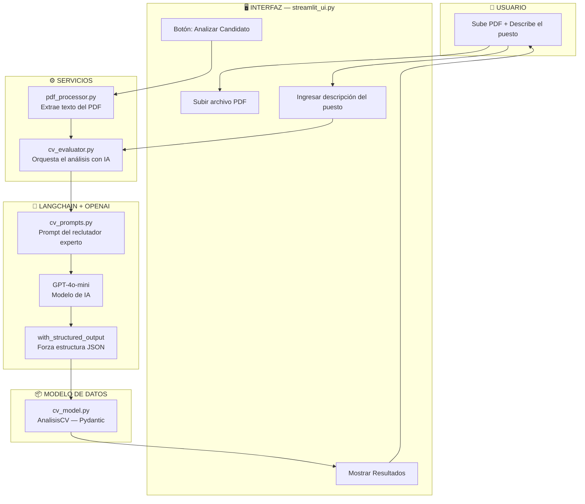
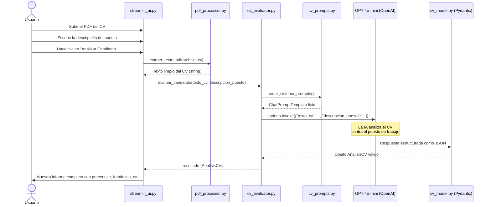
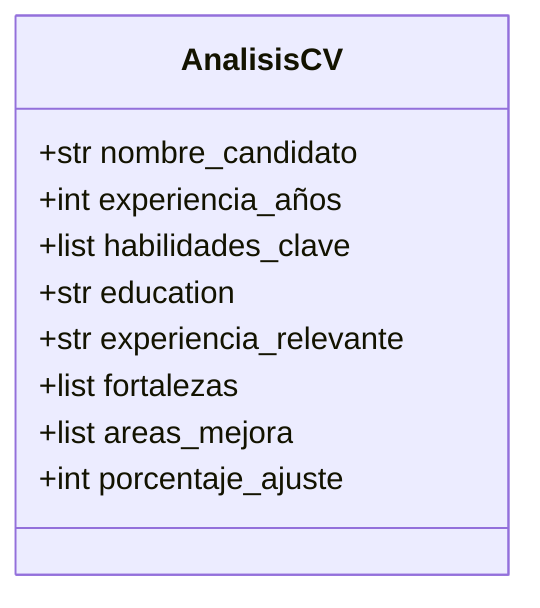
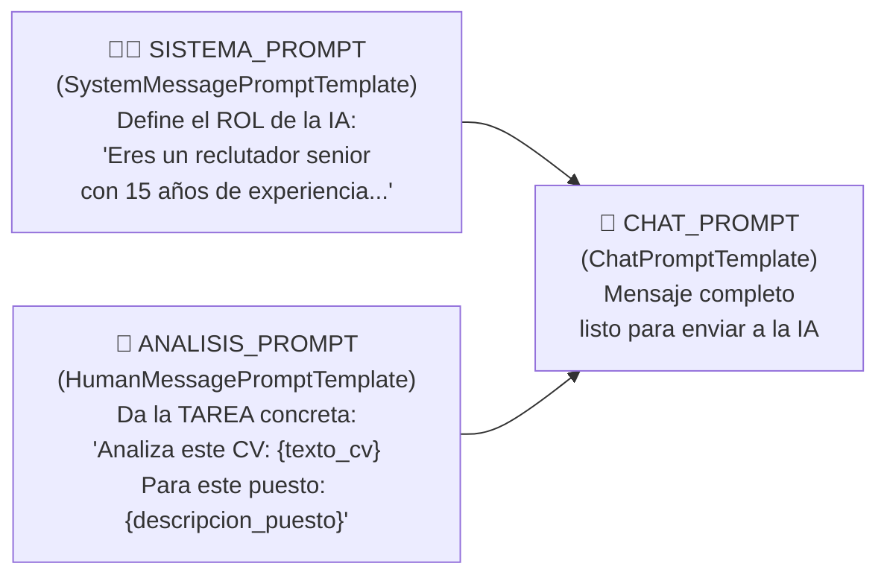
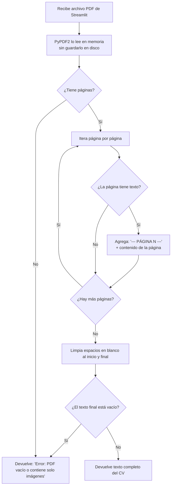
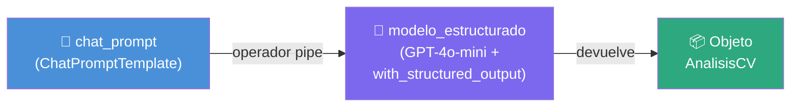
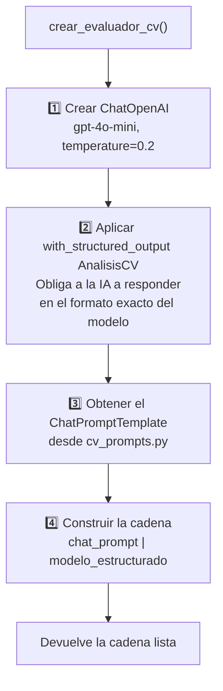
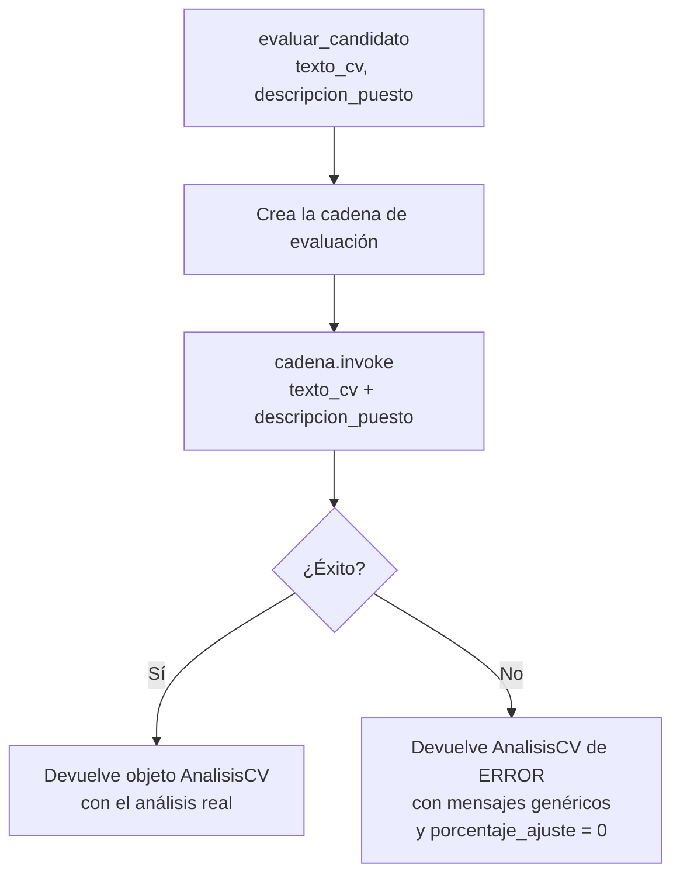
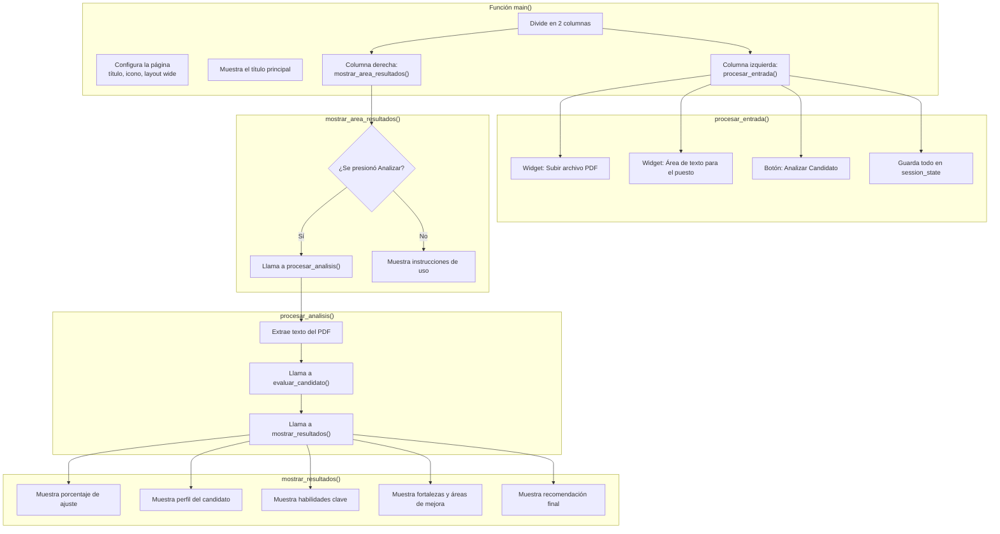
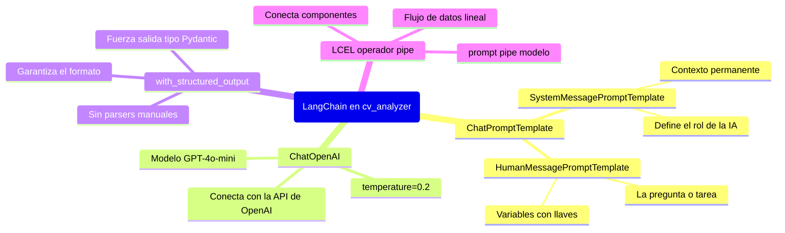

# 📄 Guía Completa del Proyecto `cv_analyzer`
### Análisis de Hojas de Vida con LangChain e Inteligencia Artificial

> **Versión del código:** Corregida y actualizada — Todos los bugs y librerías deprecadas han sido corregidos.

---

## 🎯 ¿Qué hace este proyecto?

Es una **aplicación web** que recibe el CV de un candidato en PDF y la descripción de un puesto de trabajo, y usa **Inteligencia Artificial (GPT-4o-mini)** para evaluar qué tan bien encaja ese candidato con ese puesto. Al final, muestra un informe completo con puntuaciones, fortalezas y áreas de mejora.

---

## 🗂️ Estructura de Archivos

```
cv_analyzer/
│
├── app.py                    ← Punto de entrada (arranca la app)
│
├── models/
│   └── cv_model.py           ← Define la ESTRUCTURA de datos del resultado
│
├── prompts/
│   └── cv_prompts.py         ← Las INSTRUCCIONES que le damos a la IA
│
├── services/
│   ├── pdf_processor.py      ← Extrae el TEXTO del PDF
│   └── cv_evaluator.py       ← ORQUESTA todo: conecta la IA con el resto
│
└── ui/
    └── streamlit_ui.py       ← La INTERFAZ VISUAL que ve el usuario
```

> [!NOTE]
> Cada carpeta tiene una responsabilidad clara. Esto se llama **separación de responsabilidades** y es una buena práctica de programación.

---

## 🏗️ Arquitectura General



---

## 🔄 Flujo Paso a Paso



---

## 📁 Análisis Archivo por Archivo

---

### 1️⃣ `app.py` — El Punto de Entrada

```python
import streamlit as st
from ui.streamlit_ui import main

if __name__ == "__main__":
    main()
```

**¿Qué hace?**
Es el archivo que se ejecuta con el comando `streamlit run app.py`. Su única responsabilidad es llamar a la función `main()` de la interfaz gráfica. Es como el interruptor de encendido.

---

### 2️⃣ `models/cv_model.py` — El Molde del Resultado

```python
from pydantic import BaseModel, Field

class AnalisisCV(BaseModel):
    nombre_candidato: str
    experiencia_años: int
    habilidades_clave: list[str]   # 5-7 habilidades relevantes
    education: str
    experiencia_relevante: str
    fortalezas: list[str]           # 3-5 fortalezas
    areas_mejora: list[str]         # 2-4 áreas de mejora
    porcentaje_ajuste: int          # 0-100
```

**¿Qué hace?**
Define exactamente cómo debe lucir el resultado del análisis. Usa **Pydantic**, que es una librería de Python para validar datos. Piénsalo como un **formulario oficial** que la IA debe rellenar.



> [!TIP]
> **¿Por qué Pydantic?** Sin él, la IA podría devolver el resultado en cualquier formato (texto libre, JSON mal formado, etc.). Pydantic garantiza que siempre obtenemos exactamente los campos que necesitamos.

---

### 3️⃣ `prompts/cv_prompts.py` — Las Instrucciones para la IA

Este archivo tiene **dos partes** que se combinan:



**El sistema de pesos para la puntuación (dentro del prompt):**

| Criterio | Peso |
|---|---|
| Experiencia relevante | 40% |
| Habilidades técnicas | 35% |
| Formación y certificaciones | 15% |
| Coherencia profesional | 10% |

> [!NOTE]
> Las variables entre llaves `{texto_cv}` y `{descripcion_puesto}` son **marcadores de posición**. LangChain los reemplazará con los datos reales justo antes de enviar el mensaje a la IA.

---

### 4️⃣ `services/pdf_processor.py` — El Lector de PDFs

```python
def extraer_texto_pdf(archivo_pdf):
    pdf_reader = PyPDF2.PdfReader(BytesIO(archivo_pdf.read()))
    texto_completo = ""
    for numero_pagina, pagina in enumerate(pdf_reader.pages, 1):
        texto_pagina = pagina.extract_text()
        if texto_pagina.strip():
            texto_completo += f"\n--- PÁGINA {numero_pagina} ---\n"
            texto_completo += texto_pagina + "\n"
    return texto_completo.strip()
```

**¿Qué hace paso a paso?**



> [!WARNING]
> Esta función **no funciona con PDFs escaneados** (fotos del documento). Solo funciona cuando el PDF tiene texto seleccionable. Para PDFs escaneados se necesitaría OCR (reconocimiento óptico de caracteres).

---

### 5️⃣ `services/cv_evaluator.py` — El Cerebro del Sistema

Este es el archivo más importante. Construye la **cadena LangChain** y ejecuta el análisis.

#### La Cadena LCEL (LangChain Expression Language)



**El operador `|` (pipe)** conecta componentes como si fuera una tubería: la salida del primero es la entrada del segundo.

#### `crear_evaluador_cv()` — Construye la cadena



#### `evaluar_candidato()` — Ejecuta el análisis



> [!TIP]
> **¿Qué significa `temperature=0.2`?** La temperatura controla qué tan "creativa" o "aleatoria" es la IA:
> - `temperature=0.0` → Muy determinista, siempre la misma respuesta
> - `temperature=0.2` → Mayormente consistente, con poca variación (ideal para evaluaciones objetivas)
> - `temperature=1.0` → Muy creativo y variable (ideal para escritura creativa)

---

### 6️⃣ `ui/streamlit_ui.py` — La Interfaz Visual



**Lógica de colores para el porcentaje de ajuste:**

| Rango | Color | Nivel | Recomendación |
|---|---|---|---|
| 80% - 100% | 🟢 Verde | EXCELENTE | Candidato altamente recomendado |
| 60% - 79% | 🟡 Amarillo | BUENO | Candidato recomendado con reservas |
| 40% - 59% | 🟠 Naranja | REGULAR | Requiere evaluación adicional |
| 0% - 39% | 🔴 Rojo | BAJO | Candidato no recomendado |

---

## 🧩 Conceptos Clave de LangChain Usados



---

## 🔑 Conceptos Explicados para Principiantes

### ¿Qué es una "Cadena" en LangChain?
Una cadena es la conexión de varios componentes en secuencia. En este proyecto:
```
Prompt  →  Modelo de IA  →  Objeto AnalisisCV
```
El operador `|` (pipe) es el que hace esa conexión, igual que en una fábrica donde una máquina le pasa el producto a la siguiente.

### ¿Qué es un `PromptTemplate`?
Es una plantilla de texto con "huecos" (variables). Defines la estructura del mensaje una sola vez y luego llenas los huecos con datos diferentes cada vez. En este proyecto, los huecos son `{texto_cv}` y `{descripcion_puesto}`.

### ¿Qué es `with_structured_output`?
Es la forma de decirle a la IA: *"No me respondas con texto libre, rellena este formulario específico"*. El "formulario" es la clase `AnalisisCV` de Pydantic. Esto hace que el resultado sea siempre predecible y fácil de usar en código.

### ¿Qué es `session_state` en Streamlit?
Streamlit recarga la página completa con cada interacción del usuario. `session_state` es como una "memoria" que guarda datos entre esas recargas para que no se pierdan.

---

---

## 🔧 Correcciones y Actualizaciones Aplicadas al Código

Esta sección documenta todos los cambios realizados sobre el código original.

---

### 🐛 Bug #1 y #2 — Typos en `cv_evaluator.py` (bloque `except`)

**Archivo:** [`cv_evaluator.py`](services/cv_evaluator.py)

> [!CAUTION]
> Estos dos typos causaban que el manejo de errores **también fallara**, lanzando un segundo error encima del error original. El programa se caía aunque hubiera un `try/except`.

```diff
- fotalezas=["Requiere revisión manual del CV"],
+ fortalezas=["Requiere revisión manual del CV"],

- porcetaje_ajuste=0
+ porcentaje_ajuste=0
```

---

### 📦 Deprecación #1 — `PyPDF2` → `pypdf` en `pdf_processor.py`

**Archivo:** [`pdf_processor.py`](services/pdf_processor.py)

> [!WARNING]
> `PyPDF2` fue **oficialmente deprecado en diciembre de 2022** y ya no recibe actualizaciones ni parches de seguridad. El proyecto fue absorbido por la librería original `pypdf`.

```diff
- import PyPDF2
- pdf_reader = PyPDF2.PdfReader(BytesIO(archivo_pdf.read()))

+ from pypdf import PdfReader
+ pdf_reader = PdfReader(BytesIO(archivo_pdf.read()))
```

**Para actualizar el entorno:**
```bash
pip uninstall PyPDF2
pip install pypdf
```

| | `PyPDF2` | `pypdf` |
|---|---|---|  
| Estado | ❌ Deprecado (2022) | ✅ Activo y mantenido |
| Última versión | 3.0.0 (final) | Actualizaciones regulares |
| API | Igual | Igual + mejoras |

---

### 📦 Deprecación #2 — Estilo de Pydantic v1 → Pydantic v2 en `cv_model.py`

**Archivo:** [`cv_model.py`](models/cv_model.py)

> [!NOTE]
> Pydantic v2 (lanzado en 2023) reemplazó el patrón `class Config:` interno por `model_config = ConfigDict(...)`. El patrón antiguo sigue funcionando pero genera advertencias de deprecación.

```diff
- from pydantic import BaseModel, Field
+ from pydantic import BaseModel, Field, ConfigDict

  class AnalisisCV(BaseModel):
+     model_config = ConfigDict(str_strip_whitespace=True)
      ...
```

| | Pydantic v1 (antiguo) | Pydantic v2 (actual) |
|---|---|---|
| Configuración | `class Config:` interno | `model_config = ConfigDict(...)` |
| Estado | ⚠️ Genera advertencias | ✅ Recomendado |

---

### ✨ Mejora #1 — Sintaxis moderna de prompts en `cv_prompts.py`

**Archivo:** [`cv_prompts.py`](prompts/cv_prompts.py)

> [!TIP]
> Ambas formas son válidas, pero la documentación oficial actual de LangChain recomienda la sintaxis con tuplas por ser más concisa y legible.

```diff
- from langchain_core.prompts import (
-     ChatPromptTemplate,
-     SystemMessagePromptTemplate,
-     HumanMessagePromptTemplate
- )
-
- SISTEMA_PROMPT = SystemMessagePromptTemplate.from_template("...")
- ANALISIS_PROMPT = HumanMessagePromptTemplate.from_template("...")
- CHAT_PROMPT = ChatPromptTemplate.from_messages([SISTEMA_PROMPT, ANALISIS_PROMPT])

+ from langchain_core.prompts import ChatPromptTemplate
+
+ CHAT_PROMPT = ChatPromptTemplate.from_messages([
+     ("system", SISTEMA_TEXTO),
+     ("human",  ANALISIS_TEXTO),
+ ])
```

---

### ✨ Mejora #2 — Cadena construida una sola vez en `cv_evaluator.py`

**Archivo:** [`cv_evaluator.py`](services/cv_evaluator.py)

> [!TIP]
> En el código original, la cadena LangChain se creaba **dentro de `evaluar_candidato()`**, lo que significaba reconstruir la conexión con OpenAI en cada análisis. Ahora se construye **una sola vez** cuando el módulo se importa.

```diff
  def evaluar_candidato(texto_cv, descripcion_puesto):
-     cadena_evaluacion = crear_evaluador_cv()  # Se creaba aquí cada vez
-     resultado = cadena_evaluacion.invoke({...})

+ # A nivel de módulo (una sola vez al iniciar)
+ _cadena_evaluacion = crear_evaluador_cv()
+
+ def evaluar_candidato(texto_cv, descripcion_puesto):
+     resultado = _cadena_evaluacion.invoke({...})  # Reutiliza la cadena
```

---

### 📋 Tabla Resumen de Todos los Cambios

| Archivo | Tipo | Descripción |
|---|---|---|
| `cv_evaluator.py` | 🐛 Bug fix | `fotalezas` → `fortalezas` |
| `cv_evaluator.py` | 🐛 Bug fix | `porcetaje_ajuste` → `porcentaje_ajuste` |
| `pdf_processor.py` | ⛔ Deprecado | `PyPDF2` → `pypdf` |
| `cv_model.py` | ⚠️ Deprecado | Agregado `ConfigDict` de Pydantic v2 |
| `cv_prompts.py` | ✨ Mejora | Sintaxis de tuplas (estilo moderno) |
| `cv_evaluator.py` | ✨ Mejora | Cadena construida una sola vez |

---

## 🚀 ¿Cómo Ejecutar el Proyecto?

```bash
# Desde la carpeta cv_analyzer
streamlit run app.py
```

**Variables de entorno necesarias:**
```bash
OPENAI_API_KEY=tu-clave-de-openai-aqui
```

**Instalar dependencias actualizadas:**
```bash
pip install langchain langchain-openai langchain-core
pip install pypdf          # Reemplaza a PyPDF2 (ya no usar PyPDF2)
pip install pydantic       # v2 o superior
pip install streamlit
```

---

*Documento generado para el proyecto `cv_analyzer` — Tema 2 de LangChain*
*Última actualización: código corregido y actualizado (deprecaciones resueltas)*
