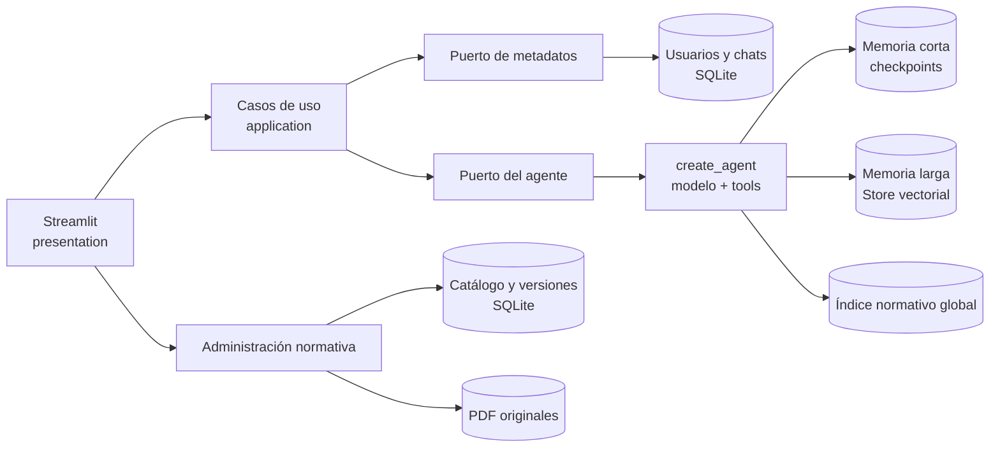
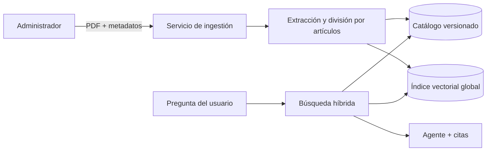

# 7. Chat multiusuario mejorado

Este proyecto conserva la finalidad didáctica de `6-multiuser_chat_system`,
pero reorganiza el sistema para que cada responsabilidad pueda crecer o
cambiarse sin arrastrar a las demás. La carpeta del ejercicio 6 no se importa ni
se modifica: ambos proyectos pueden ejecutarse y compararse por separado.

## Patrón utilizado

No existe un único equivalente de MVC para agentes. Aquí se combinan dos ideas:

1. **Arquitectura por capas con puertos y adaptadores**: dominio, casos de uso,
   infraestructura y presentación se comunican mediante contratos pequeños.
2. **Agent harness dentro de un flujo determinista**: el modelo decide cuándo
   usar herramientas, pero Python conserva el control de identidad, permisos,
   persistencia y escritura de memoria.



La regla importante es la dirección: Streamlit conoce los casos de uso, pero no
conoce SQL ni OpenAI. El dominio tampoco conoce ninguna de esas tecnologías.

## Comparación con el ejercicio 6

| Tema | Tutorial 6 | Proyecto 7 mejorado |
|---|---|---|
| Flujo | `StateGraph` fijo de cuatro nodos | `create_agent` elige herramientas dentro de límites |
| Organización | UI, chatbot y memoria con dependencias directas | capas + puertos intercambiables |
| Memoria corta | un archivo SQLite por usuario | un checkpointer con `thread_id = usuario:chat` |
| Memoria larga | Chroma por usuario | LangGraph Store con *namespace* por usuario |
| Extracción | como máximo un hecho por mensaje | lote estructurado de cero a diez hechos |
| Actualizaciones | nuevos documentos pueden duplicar datos | clave semántica estable reemplaza el dato anterior |
| Contexto | se mezcla al construir el prompt del nodo | middleware dinámico, sin contaminar el historial |
| Herramientas | no aplica; es un workflow | recuerdos privados, normas globales y hora como herramientas de lectura |
| Fallos de memoria | pueden detener el turno | la respuesta se conserva y se muestra un aviso no fatal |
| Pruebas | verificación manual | dominio/casos de uso/SQLite probables sin API |

El proyecto 6 no está "mal": muestra de forma explícita cómo construir un
grafo. El 7 responde a otra etapa del aprendizaje: mantener y escalar el mismo
producto.

## Recorrido de un mensaje

1. La UI entrega `user_id`, `chat_id` y texto al caso de uso.
2. El caso de uso comprueba que el chat pertenece al usuario.
3. Se buscan recuerdos pertinentes; si embeddings falla, existe respaldo local.
4. El middleware agrega esos recuerdos al mensaje de sistema solo para el turno.
5. El agente responde directamente o llama una herramienta de lectura.
6. LangGraph guarda mensajes y llamadas de herramientas en el checkpoint.
7. Otro wrapper del modelo extrae **varios** hechos con JSON Schema.
8. Cada hecho se guarda bajo `(user_id, "memories")` y una clave estable.
9. Solo al finalizar se incrementa el contador del chat.

## RAG normativo compartido

La versión 7.3 añade una fuente de conocimiento global sin mezclarla con los
recuerdos personales. Todos los usuarios consultan las mismas normas vigentes,
pero cada uno mantiene separados su historial y sus datos privados.



La búsqueda combina similitud semántica con coincidencias textuales. Esto es
útil en derecho porque una consulta puede expresar un concepto con palabras
distintas, pero también puede mencionar exactamente `artículo 76` o un número
de ley. Solo entran al contexto versiones con estado `active` y dentro de sus
fechas declaradas de vigencia.

Los estados disponibles son:

- `draft`: el PDF está guardado, pero no responde preguntas;
- `active`: versión publicada y recuperable por todos los usuarios;
- `superseded`: reemplazada por una versión nueva, conservada para auditoría;
- `repealed`: retirada por pérdida de vigencia, conservada para auditoría.

La eliminación física requiere una confirmación diferente del retiro. Para una
actualización normal se recomienda cargar la versión nueva con la misma
`logical_key`, publicarla y dejar que el sistema marque la anterior como
reemplazada.

### Cargar normas desde la interfaz

1. Define `KNOWLEDGE_ADMIN_PASSWORD` en el `.env` de la raíz.
2. Abre la sección **Administrar normas**.
3. Inicia sesión y carga un PDF proveniente de una fuente oficial.
4. Completa título, jurisdicción, versión, vigencia y URL de procedencia.
5. Conserva la misma clave normativa cuando cargues una actualización.
6. Publica la versión solo después de revisar sus metadatos.

La extracción actual procesa PDF que ya contienen texto. Un documento formado
solo por imágenes se conserva fuera del alcance: debe pasar primero por OCR. El
backend está desacoplado mediante `PDFTextExtractor`, de modo que se puede añadir
un adaptador OCR posteriormente sin modificar el agente ni la interfaz.

## Estructura

```text
7-chat-multiusuario-mejorado/
├── agent/           # prompt, tools, extractor y runtime de LangChain
├── application/     # casos de uso y composición de dependencias
├── domain/          # entidades, validaciones y puertos
├── infrastructure/  # implementaciones SQLite y memoria
├── presentation/    # componentes de Streamlit
├── tests/           # pruebas sin llamadas a OpenAI
├── app.py           # punto de entrada
└── config.py        # configuración central
```

## Instalación y ejecución

Desde la raíz del repositorio, con el entorno virtual ya creado:

```powershell
.\venv\Scripts\python.exe -m pip install -r ".\Tema_5\7-chat-multiusuario-mejorado\requirements.txt"
.\venv\Scripts\python.exe -m streamlit run ".\Tema_5\7-chat-multiusuario-mejorado\app.py" --server.port 8512
```

Abre `http://localhost:8512`. La aplicación lee `OPENAI_API_KEY` desde el `.env`
de la raíz. `.env.example` documenta las variables opcionales sin guardar la
clave real.

Para verificar las piezas que no necesitan conexión:

```powershell
Set-Location ".\Tema_5\7-chat-multiusuario-mejorado"
..\..\venv\Scripts\python.exe -m unittest discover -s tests -v
```

La prueba integral consume unas pocas llamadas de API y elimina su chat al
terminar:

```powershell
..\..\venv\Scripts\python.exe .\tests\smoke_agent.py
```

## Persistencia y privacidad

La carpeta ignorada `runtime/` contiene las bases independientes:

- `metadata.sqlite3`: usuarios, títulos y contadores;
- `checkpoints.sqlite3`: historial de cada conversación;
- `memories.sqlite3`: hechos compartidos entre chats del mismo usuario.
- `normative_knowledge.sqlite3`: catálogo, artículos, vigencia e índice RAG.
- `normative_documents/`: copias de los PDF cargados para auditoría.

Parar y volver a iniciar Streamlit no elimina ninguna de ellas. La interfaz
permite auditar y borrar recuerdos individuales. El extractor tiene la regla de
no guardar secretos; aun así, una aplicación real debe añadir autenticación,
cifrado, políticas de retención y evaluaciones específicas de privacidad.

## Fuentes técnicas

- [OpenAI: modelos y patrones actuales](https://developers.openai.com/api/docs/guides/latest-model)
- [LangChain: Agents](https://docs.langchain.com/oss/python/langchain/agents)
- [LangChain: Context engineering](https://docs.langchain.com/oss/python/langchain/context-engineering)
- [LangGraph: Persistence](https://docs.langchain.com/oss/python/langgraph/persistence)
- [OpenAI: búsqueda y filtros en Vector Stores](https://developers.openai.com/api/reference/python/resources/vector_stores/methods/search)
