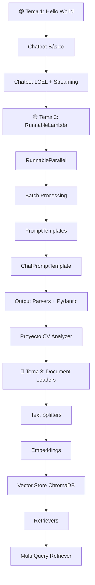

# 🏠 Mapa del Conocimiento — Curso LangChain

> **Propósito:** Vault de estudio progresivo del proyecto `p1_lanchain`.  
> Cada nota documenta un archivo `.py` real del proyecto con sus conceptos, librerías, clases y recomendaciones.

---

## 📁 Estructura del Proyecto

```
p1_lanchain/
├── Tema_1/   → Primeros pasos con LLMs y Streamlit
├── Tema_2/   → Runnables, Prompts, Parsers y Proyecto CV Analyzer
├── Tema_3/   → RAG: Document Loaders, Embeddings y Vectorstores
└── conocimiento/  ← estás aquí
```

---

## 🗺️ Mapa de Temas

### 📘 Tema 1 — Fundamentos de LLM con LangChain
| Archivo | Nota | Descripción |
|---|---|---|
| `hello_world.py` | [[Tema1-01 Hello World LLM]] | Primera llamada a Gemini |
| `str_chat.py` | [[Tema1-02 Chatbot Básico Streamlit]] | Chatbot simple OpenAI + Streamlit |
| `str_chat_mejorado.py` | [[Tema1-03 Chatbot Mejorado con LCEL]] | Chatbot avanzado con LCEL, streaming y sidebar |

### 📗 Tema 2 — Runnables, Prompts y Output Parsers
| Archivo | Nota | Descripción |
|---|---|---|
| `1.runeables_orquestadoporfuncion.py` | [[Tema2-01 Runnables Orquestados]] | RunnableLambda con función orquestadora |
| `2.runeables_paralelo.py` | [[Tema2-02 Runnables en Paralelo]] | RunnableParallel — ejecución concurrente |
| `3.runeables_por_lotes.py` | [[Tema2-03 Runnables por Lotes]] | `.batch()` — procesamiento masivo |
| `4.prompt_templates.py` | [[Tema2-04 PromptTemplate Básico]] | Plantillas de texto con variables |
| `5.chat_prompt_template.py` | [[Tema2-05 ChatPromptTemplate]] | Prompts multi-rol system/human |
| `6.message_placeholder.py` | [[Tema2-06 MessagesPlaceholder]] | Historial inyectado en prompts |
| `7.plant_esp_rol.py` | [[Tema2-07 Plantilla Especializada por Rol]] | System + Human con variables dinámicas |
| `8.output_parsers.py` | [[Tema2-08 Pydantic Básico]] | BaseModel sin LLM |
| `9.output_parsers_pydantic.py` | [[Tema2-09 Structured Output con Pydantic]] | `with_structured_output()` |
| `10.pydantic.py` | [[Tema2-10 Pydantic Avanzado con Keywords]] | Pydantic + lista de palabras clave |
| `cv_analyzer/` | [[Tema2-11 Proyecto CV Analyzer]] | App completa de evaluación de CVs |

### 📙 Tema 3 — RAG: Documentos, Embeddings y Vectorstores
| Archivo | Nota | Descripción |
|---|---|---|
| `1-document_loader.py` | [[Tema3-01 Document Loader PDF]] | PyPDFLoader — carga de PDFs |
| `2-google_drive.py` | [[Tema3-02 Google Drive Loader]] | OAuth2 + GoogleDriveLoader |
| `3-text_splitters_parte1.py` | [[Tema3-03 Text Splitter Parte 1]] | Problema del contexto largo |
| `4-text_splitters_parte2.py` | [[Tema3-04 Text Splitter Parte 2]] | RecursiveCharacterTextSplitter |
| `5-embeding_langchain.py` | [[Tema3-05 Embeddings OpenAI]] | Vectores semánticos + cosine similarity |
| `6-almacen_vectorial_contratos.py` | [[Tema3-06 Vector Store Chroma]] | Chroma DB + búsqueda por similitud |
| `7-retrievers.py` | [[Tema3-07 Retrievers]] | Retriever desde BD existente |
| `8-multy-query-retriever.py` | [[Tema3-08 Multi-Query Retriever]] | Múltiples consultas automáticas |

---

## 🔗 Notas Transversales
- [[Librerías y Dependencias]] — Todas las librerías usadas, versiones y estado de deprecación
- [[Clases y Funciones Clave]] — Referencia rápida de clases y métodos
- [[Librerías Deprecadas y Alternativas]] — Qué evitar y qué usar hoy
- [[Recomendaciones y Buenas Prácticas]] — Consejos modernos de LangChain
- [[Glosario RAG y LLM]] — Términos clave del dominio

---

## 🧭 Ruta de Estudio Progresiva



---

*Vault creado automáticamente — Julio 2026*
